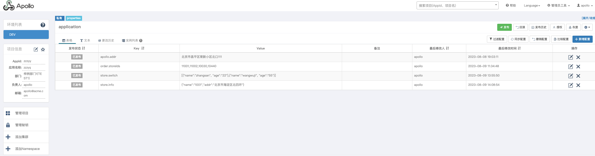

> 项目结构 dao层 api层

> 什么是自定义注解？

三个元注解 加 默认值
Person.class.getDeclaredFields()
可以获取到类上面的注解
自定义注解的作用是啥 有什么好处 用在哪？

可以放在类上面 通过反射来获取注解上的属性值
还可以在aop中拦截controller 然后其中的方法getMethod以及方法的getDeclaredAnnotation

elasticsearch 
如果有id 再次插入数据会覆盖 如果没有id会生成新的数据

Apollo配置实时读取 目前读取配置通过设置JVM参数 -Dapollo.configService=http://172.16.244.134:8081 -Denv=DEV
读取单值  读取list  1001,1002,1003  读取list对象 [{"name":"xx"},{}] SingleSwitch 读取对象

> 读取list对象
JSON.parseArray(params, SingleSwitch.class)

> 读取对象
JSON.parseObject(param, Addr.class)
> 

事务失效的几个场景  @Transactional注解
1、异常捕获后未抛出
2、抛出了非运行时异常 throw new MyException
3、方法内部直接调用  一个方法调用了同一个类中的事务方法 因为没有生成代理，修改方式可以把当前类自己注入一下调用即可
4、新开启了一个线程 且线程内有异常
  因为springboot实现事务的原理是通过ThreadLocal把数据库连接绑定到当前线程中 新开启一个线程取到的连接就不是同一个了
5、注解到private方法上
6、数据库本身不支持  比如必须是数据库引擎 innoDB
7、事务传播属性设置错误 （以非事务的方式执行，如果当前有事务则把当前事务挂起）

Spring 事务传播机制 7种
1、Propagation.REQUIRED 如果当前存在事务 则加入该事务 如果当前没有事务 则创建一个新的事务 （默认的事务传播级别）
2、Propagation.SUPPORTS 如果当前存在事务 则加入该事务 如果当前没有事务 则以非事务的方式继续运行

> Spring Boot启动的时候会通过@EnableAutoConfiguration注解找到META-INF/spring.factories配置文件中的所有自动配置类，并对其进行加载，
> 而这些自动配置类都是以AutoConfiguration结尾来命名的，它实际上就是一个JavaConfig形式的Spring容器配置类，
> 它能通过以Properties结尾命名的类中取得在全局配置文件中配置的属性如：server.port，而XxxxProperties类是通过@ConfigurationProperties注解与全局配置文件中对应的属性进行绑定的。
   示例： https://zhuanlan.zhihu.com/p/399405329

>  spring 异步执行

首先在方法上要引入注解 @Async注解  其次要在启动类上添加@EnableAsync 使异步注解生效
其次注意：异步要使用代理类 所以不能在同一个类中进行调用 或者引入自己这个类去调用

>> 异步下载

异步下载 使用异步方法 先进行响应 之后后台执行异步方法，等到执行完毕进行生成excel 进行保存值指定的文件夹下
此种方式就不会造成响应浏览器超时的情况，比如执行逻辑5分钟，之后根据结果执行下载操作，将下载文件保存至指定的文件夹下
同样也可以考虑 将文件通过发邮件附件的方式进行

----------- SPU 和 SKU的区别 -----------
SKU stock keeping unit 库存量单位 128G 8999 玫瑰金 类似与Java的实例对象
SPU 标准化产品单元  小米15 （它聚合了小米15的所有属性 包括内存大小 颜色 版本 库存量） 类似Java中的类
你买到的是sku

规格参数 销售属性
iphone XS MAX spu
金色 64G版/玫瑰金 128G版
基础属性叫规格与包装  其他不同的属性(颜色、版本、库存量等)叫销售属性

同一个SPU的不同SKU共享旗下的基本介绍-规格与保证，不同的是销售属性
SPU来决定规格参数的值，SKU来决定销售属性的值 SKU的值不同，那么它对应的销售属性就不同

redisson 
watchDog 机制其实就是一个后台定时任务线程，获取锁成功之后，会将持有锁的线程放到一个map里面，然后每隔10秒检查一下
如果客户端还持有锁key，其实就是判断线程id在redis是否存在，如果存在，就会延长key的时间

注：如果服务宕机了，watchDog机制线程也就没有了，此时就不会延长key的过期时间，到了30s后就会自动过期了，其他线程就可以获取到锁。

注意：leaseTime必须是-1 才会开启watch dog机制 如果需要开启watch dog机制就必须使用默认的加锁时间为30s
如果你自己自定义时间 超过这个时间，锁就会自动释放，并不会自动续期~

自动续期 启动守护线程，去重新设置这个锁的LockTime，在redisson实例被关闭前 不断延长锁的有效期

